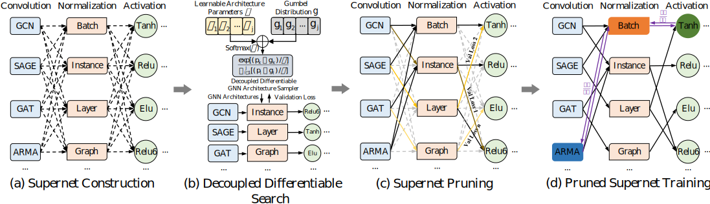

# D<sup>2</sup>GNAS

- D<sup>2</sup>GNAS is an efficient graph neural architecture search method with decoupled differentiable search.

- The framework of D<sup>2</sup>GNAS is as follows:

<br>
<div align=left>  </div>


**Environment requirement**
```python
requirement.txt
```
## Running the Experiment
**1.Performance test with manual GNN and the optimal GNN designed by D<sup>2</sup>GNAS**
```python
python performance_test.py
```

**2.Search the top promising GNN architectures from scratch with all GNAS methods**
```python
python search_from_scratch.py
```

**3.Testing the optimal GNN architecture from top promising GNN architectures with HPO**
```python
python performance_test_with_hpo.py
```
